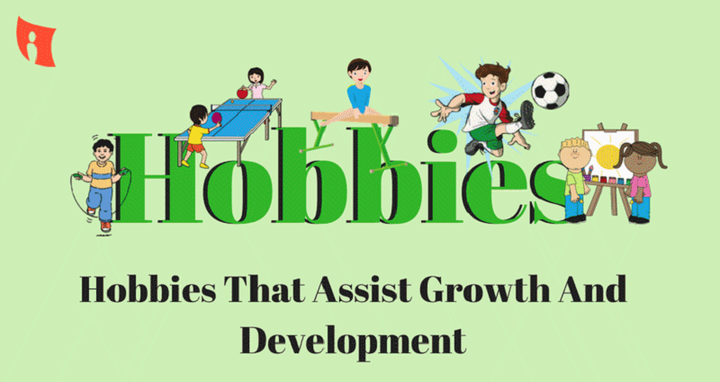

# Children Hobby Prediction



## 📌Overview
Using machine learning techniques, this project predicts students' preferred hobbies (e.g., Academics, Arts, Sports) based on their academic, sports, and artistic interests. The dataset, `Hobby_Data.csv`, contains features like scholarship status, favorite subjects, sports participation, and arts engagement. A Logistic Regression model is implemented to classify students' hobbies, achieving an accuracy of approximately 89%. The repository demonstrates data loading, preprocessing, modeling, and evaluation.

## 📂Dataset
### Description
The dataset captures students' preferences and activities to predict their likely hobbies.

- **Source**: `Hobby_Data.csv` (stored locally or in Google Drive).
- **Size**: 1,601 rows, 14 columns.
- **Columns**:
  - `Olympiad_Participation`: Participation in Olympiads (Yes/No).
  - `Scholarship`: Received a scholarship (Yes/No).
  - `School`: Enrolled in school (Yes/No).
  - `Fav_sub`: Favorite subject (e.g., Mathematics, Science, History/Geography).
  - `Projects`: Participation in projects (Yes/No).
  - `Grasp_pow`: Grasping power (1-6 scale, integer).
  - `Time_sprt`: Hours spent on sports per week (1-6, integer).
  - `Medals`: Won medals in sports (Yes/No).
  - `Career_sprt`: Interest in a sports career (Yes/No).
  - `Act_sprt`: Interest in sports for fun (Yes/No).
  - `Fant_arts`: Interest in creative arts (Yes/No).
  - `Won_arts`: Awards in arts (Yes/No/Maybe).
  - `Time_art`: Hours spent on arts per week (1-6, integer).
  - `Predicted Hobby`: Target variable (e.g., Academics, Arts, Sports; encoded as 0, 1, 2).

### Acknowledgements
The dataset appears to be custom-generated or simulated for educational purposes. No specific external source is cited.

## 🛠Methodology
### Dependencies
The project uses the following Python libraries:
```python
import pandas as pd
import numpy as np
import matplotlib.pyplot as plt
import seaborn as sns
import plotly.express as px
from sklearn.linear_model import LogisticRegression
from sklearn.model_selection import train_test_split, RandomizedSearchCV
from sklearn.tree import DecisionTreeClassifier
from sklearn.ensemble import RandomForestClassifier
from sklearn.metrics import accuracy_score
```

## 🔍Approach

### Data Loading
- Load the dataset from `Hobby_Data.csv` with `skipinitialspace=True`.

### Exploratory Data Analysis (EDA)
- Inspect data structure using `df.info()`: 1,601 entries, no missing values.
- Visualize relationships, such as `Time_art` vs. `Predicted Hobby`, using a density heatmap.

### Preprocessing
- Convert categorical variables (e.g., Yes/No, Fav_sub) to numerical values (assumed via encoding, not shown in snippet).
- Define features (`x`) and target (`y = Predicted Hobby`).

### Modeling
- Split data into training (75%) and testing (25%) sets using `train_test_split`.
- Train a Logistic Regression model (`lomodel`) on the training data.

### Evaluation
- Predict hobbies on the test set (`y_pred`).
- Calculate accuracy using `accuracy_score`.

## 📊Results

### Model Performance
- The Logistic Regression model achieved an accuracy of 89.03% on the test set.

#### Sample Predictions
- First 10 test predictions: [0, 1, 1, 1, 2, 2, 2, 0, 1, 0].
- Actual values: [0, 1, 1, 1, 2, 2, 2, 0, 0, 0].
- Insight: 9/10 predictions correct, indicating strong performance.
- Visualization: A density heatmap of `Time_art` vs. `Predicted Hobby` highlights correlations between time spent on arts and hobby preferences.

## 🚀Future Work
- Add preprocessing details (e.g., encoding categorical variables) to the notebook.
- Experiment with other models (e.g., Decision Tree, Random Forest) for comparison.
- Include additional visualizations (e.g., confusion matrix, feature importance).
- Optimize hyperparameters using `RandomizedSearchCV` for better accuracy.

